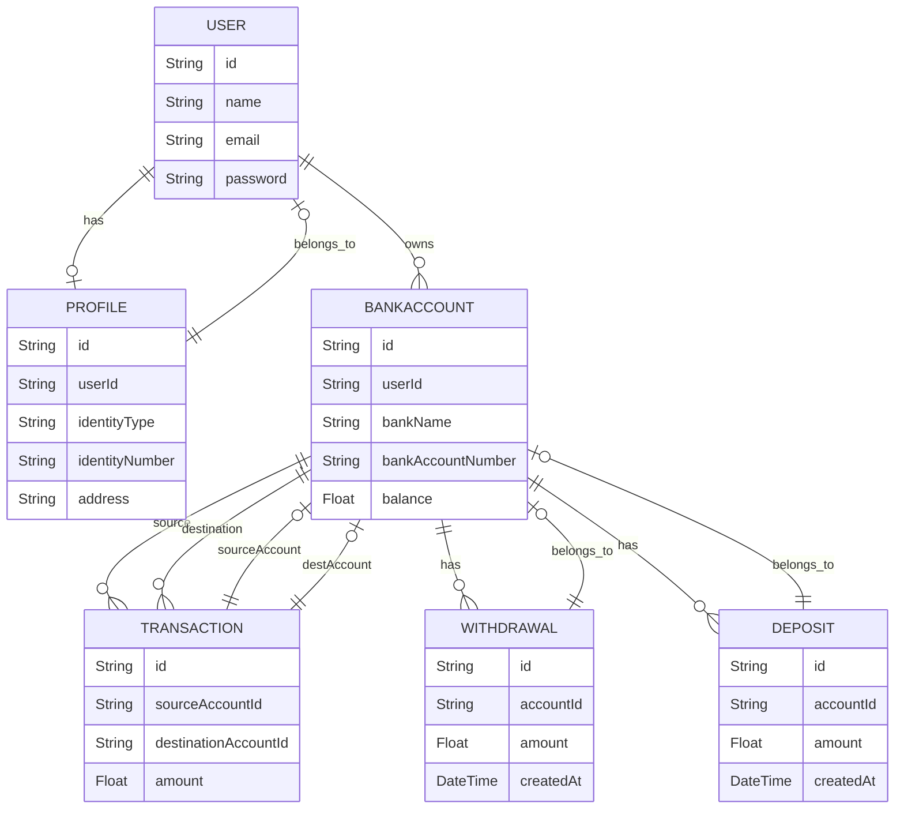

# Project ERD Documentation

This document provides an Entity Relationship Diagram (ERD) for the project. The ERD visually represents the relationships between different entities in the database schema.

## ERD Diagram

